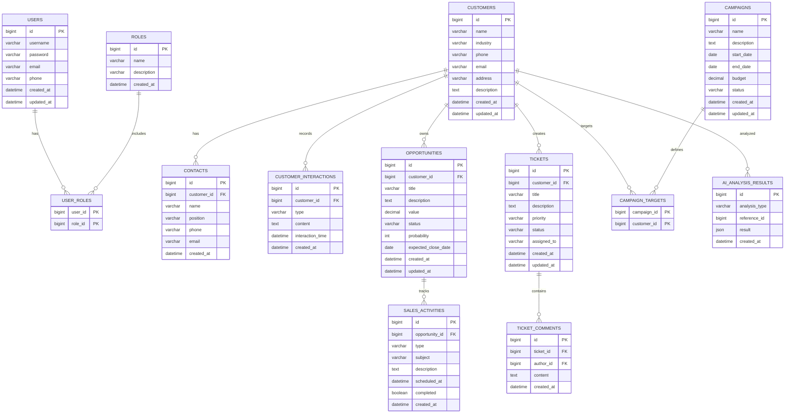

# 数据库设计文档

本文档详细描述StellarCRM系统的数据库设计，包括表结构、字段说明和关系图。

## 目录
1. [概述](#概述)
2. [实体关系图](#实体关系图)
3. [核心表结构](#核心表结构)
   - [用户表](#用户表-users)
   - [角色表](#角色表-roles)
   - [用户角色关联表](#用户角色关联表-user_roles)
   - [客户表](#客户表-customers)
   - [联系人表](#联系人表-contacts)
   - [客户交互记录表](#客户交互记录表-customer_interactions)
   - [销售机会表](#销售机会表-opportunities)
   - [销售活动表](#销售活动表-sales_activities)
   - [服务工单表](#服务工单表-tickets)
   - [工单评论表](#工单评论表-ticket_comments)
   - [营销活动表](#营销活动表-campaigns)
   - [营销活动目标客户表](#营销活动目标客户表-campaign_targets)
   - [AI分析结果表](#ai分析结果表-ai_analysis_results)
4. [图数据库设计](#图数据库设计)
5. [索引设计](#索引设计)
6. [数据初始化](#数据初始化)

## 概述

StellarCRM系统采用多数据库架构：
1. **关系型数据库(MySQL)**：存储结构化数据，如用户、客户、销售机会等
2. **图数据库(Neo4j)**：存储客户关系网络，用于复杂的关系分析
3. **缓存数据库(Redis)**：存储会话信息和热点数据

## 实体关系图



## 核心表结构

### 用户表 (users)
存储系统用户信息

| 字段名 | 类型 | 约束 | 描述 |
|--------|------|------|------|
| id | BIGINT | PRIMARY KEY, AUTO_INCREMENT | 用户ID |
| username | VARCHAR(50) | UNIQUE, NOT NULL | 用户名 |
| password | VARCHAR(255) | NOT NULL | 加密密码 |
| email | VARCHAR(100) | UNIQUE | 邮箱 |
| phone | VARCHAR(20) |  | 电话 |
| created_at | DATETIME | NOT NULL | 创建时间 |
| updated_at | DATETIME | NOT NULL | 更新时间 |

### 角色表 (roles)
存储系统角色信息

| 字段名 | 类型 | 约束 | 描述 |
|--------|------|------|------|
| id | BIGINT | PRIMARY KEY, AUTO_INCREMENT | 角色ID |
| name | VARCHAR(50) | UNIQUE, NOT NULL | 角色名称 |
| description | VARCHAR(255) |  | 角色描述 |
| created_at | DATETIME | NOT NULL | 创建时间 |

### 用户角色关联表 (user_roles)
用户与角色的多对多关联表

| 字段名 | 类型 | 约束 | 描述 |
|--------|------|------|------|
| user_id | BIGINT | FOREIGN KEY, PRIMARY KEY | 用户ID |
| role_id | BIGINT | FOREIGN KEY, PRIMARY KEY | 角色ID |

### 客户表 (customers)
存储客户基本信息

| 字段名 | 类型 | 约束 | 描述 |
|--------|------|------|------|
| id | BIGINT | PRIMARY KEY, AUTO_INCREMENT | 客户ID |
| name | VARCHAR(100) | NOT NULL | 客户名称 |
| industry | VARCHAR(50) |  | 行业 |
| phone | VARCHAR(20) |  | 电话 |
| email | VARCHAR(100) |  | 邮箱 |
| address | VARCHAR(255) |  | 地址 |
| description | TEXT |  | 描述 |
| created_at | DATETIME | NOT NULL | 创建时间 |
| updated_at | DATETIME | NOT NULL | 更新时间 |

### 联系人表 (contacts)
存储客户联系人信息

| 字段名 | 类型 | 约束 | 描述 |
|--------|------|------|------|
| id | BIGINT | PRIMARY KEY, AUTO_INCREMENT | 联系人ID |
| customer_id | BIGINT | FOREIGN KEY, NOT NULL | 客户ID |
| name | VARCHAR(100) | NOT NULL | 联系人姓名 |
| position | VARCHAR(100) |  | 职位 |
| phone | VARCHAR(20) |  | 电话 |
| email | VARCHAR(100) |  | 邮箱 |
| created_at | DATETIME | NOT NULL | 创建时间 |

### 客户交互记录表 (customer_interactions)
存储与客户的交互记录

| 字段名 | 类型 | 约束 | 描述 |
|--------|------|------|------|
| id | BIGINT | PRIMARY KEY, AUTO_INCREMENT | 记录ID |
| customer_id | BIGINT | FOREIGN KEY, NOT NULL | 客户ID |
| type | VARCHAR(50) | NOT NULL | 交互类型(电话、邮件、会议等) |
| content | TEXT | NOT NULL | 交互内容 |
| interaction_time | DATETIME | NOT NULL | 交互时间 |
| created_at | DATETIME | NOT NULL | 创建时间 |

### 销售机会表 (opportunities)
存储销售机会信息

| 字段名 | 类型 | 约束 | 描述 |
|--------|------|------|------|
| id | BIGINT | PRIMARY KEY, AUTO_INCREMENT | 机会ID |
| customer_id | BIGINT | FOREIGN KEY, NOT NULL | 客户ID |
| title | VARCHAR(200) | NOT NULL | 机会标题 |
| description | TEXT |  | 机会描述 |
| value | DECIMAL(15,2) |  | 预计金额 |
| status | VARCHAR(50) | NOT NULL | 状态(PROSPECTING, QUALIFICATION, PROPOSAL, NEGOTIATION, CLOSED_WON, CLOSED_LOST) |
| probability | INT |  | 成功概率(0-100) |
| expected_close_date | DATE |  | 预计关闭日期 |
| created_at | DATETIME | NOT NULL | 创建时间 |
| updated_at | DATETIME | NOT NULL | 更新时间 |

### 销售活动表 (sales_activities)
存储销售机会相关的活动

| 字段名 | 类型 | 约束 | 描述 |
|--------|------|------|------|
| id | BIGINT | PRIMARY KEY, AUTO_INCREMENT | 活动ID |
| opportunity_id | BIGINT | FOREIGN KEY, NOT NULL | 机会ID |
| type | VARCHAR(50) | NOT NULL | 活动类型(电话、会议、邮件等) |
| subject | VARCHAR(200) | NOT NULL | 活动主题 |
| description | TEXT |  | 活动描述 |
| scheduled_at | DATETIME | NOT NULL | 计划时间 |
| completed | BOOLEAN | NOT NULL DEFAULT FALSE | 是否完成 |
| created_at | DATETIME | NOT NULL | 创建时间 |

### 服务工单表 (tickets)
存储客户服务工单

| 字段名 | 类型 | 约束 | 描述 |
|--------|------|------|------|
| id | BIGINT | PRIMARY KEY, AUTO_INCREMENT | 工单ID |
| customer_id | BIGINT | FOREIGN KEY, NOT NULL | 客户ID |
| title | VARCHAR(200) | NOT NULL | 工单标题 |
| description | TEXT |  | 工单描述 |
| priority | VARCHAR(20) | NOT NULL | 优先级(HIGH, MEDIUM, LOW) |
| status | VARCHAR(20) | NOT NULL | 状态(OPEN, IN_PROGRESS, RESOLVED, CLOSED) |
| assigned_to | VARCHAR(50) |  | 分配给 |
| created_at | DATETIME | NOT NULL | 创建时间 |
| updated_at | DATETIME | NOT NULL | 更新时间 |

### 工单评论表 (ticket_comments)
存储工单的评论信息

| 字段名 | 类型 | 约束 | 描述 |
|--------|------|------|------|
| id | BIGINT | PRIMARY KEY, AUTO_INCREMENT | 评论ID |
| ticket_id | BIGINT | FOREIGN KEY, NOT NULL | 工单ID |
| author_id | BIGINT | FOREIGN KEY, NOT NULL | 作者ID |
| content | TEXT | NOT NULL | 评论内容 |
| created_at | DATETIME | NOT NULL | 创建时间 |

### 营销活动表 (campaigns)
存储营销活动信息

| 字段名 | 类型 | 约束 | 描述 |
|--------|------|------|------|
| id | BIGINT | PRIMARY KEY, AUTO_INCREMENT | 活动ID |
| name | VARCHAR(100) | NOT NULL | 活动名称 |
| description | TEXT |  | 活动描述 |
| start_date | DATE | NOT NULL | 开始日期 |
| end_date | DATE | NOT NULL | 结束日期 |
| budget | DECIMAL(15,2) |  | 预算 |
| status | VARCHAR(20) | NOT NULL | 状态(PLANNING, ACTIVE, COMPLETED, CANCELLED) |
| created_at | DATETIME | NOT NULL | 创建时间 |
| updated_at | DATETIME | NOT NULL | 更新时间 |

### 营销活动目标客户表 (campaign_targets)
营销活动与目标客户的多对多关联表

| 字段名 | 类型 | 约束 | 描述 |
|--------|------|------|------|
| campaign_id | BIGINT | FOREIGN KEY, PRIMARY KEY | 活动ID |
| customer_id | BIGINT | FOREIGN KEY, PRIMARY KEY | 客户ID |

### AI分析结果表 (ai_analysis_results)
存储AI分析的结果

| 字段名 | 类型 | 约束 | 描述 |
|--------|------|------|------|
| id | BIGINT | PRIMARY KEY, AUTO_INCREMENT | 结果ID |
| analysis_type | VARCHAR(50) | NOT NULL | 分析类型(SALES_FORECAST, CUSTOMER_RISK, CHURN_PREDICTION, CROSS_SELL) |
| reference_id | BIGINT | NOT NULL | 关联ID(如客户ID、机会ID等) |
| result | JSON | NOT NULL | 分析结果(JSON格式) |
| created_at | DATETIME | NOT NULL | 创建时间 |

## 图数据库设计

### 节点(Nodes)
1. **Customer**: 客户节点
   - id: 客户ID
   - name: 客户名称
   - industry: 行业
   - created_at: 创建时间

2. **Company**: 公司节点(用于表示客户公司)
   - id: 公司ID
   - name: 公司名称
   - industry: 行业
   - created_at: 创建时间

### 关系(Relationships)
1. **CUSTOMER_OF**: 客户关系
   - Customer -[:CUSTOMER_OF]-> Company

2. **PARTNER_WITH**: 合作关系
   - Company -[:PARTNER_WITH]-> Company

3. **COMPETES_WITH**: 竞争关系
   - Company -[:COMPETES_WITH]-> Company

4. **SUPPLIES_TO**: 供应关系
   - Company -[:SUPPLIES_TO]-> Company

### 示例Cypher查询
```cypher
// 查询客户公司的合作伙伴
MATCH (c:Company {id: 1})-[:PARTNER_WITH]-(partner)
RETURN partner.name

// 查询客户关系网络
MATCH (c:Customer {id: 1})-[:CUSTOMER_OF]->(company:Company)<-[:CUSTOMER_OF]-(other:Customer)
RETURN other.name
```

## 索引设计

### MySQL索引
```sql
-- 用户表索引
CREATE INDEX idx_users_username ON users(username);
CREATE INDEX idx_users_email ON users(email);

-- 客户表索引
CREATE INDEX idx_customers_name ON customers(name);
CREATE INDEX idx_customers_industry ON customers(industry);

-- 销售机会表索引
CREATE INDEX idx_opportunities_customer_id ON opportunities(customer_id);
CREATE INDEX idx_opportunities_status ON opportunities(status);
CREATE INDEX idx_opportunities_expected_close_date ON opportunities(expected_close_date);

-- 服务工单表索引
CREATE INDEX idx_tickets_customer_id ON tickets(customer_id);
CREATE INDEX idx_tickets_status ON tickets(status);
CREATE INDEX idx_tickets_priority ON tickets(priority);

-- 营销活动表索引
CREATE INDEX idx_campaigns_status ON campaigns(status);
CREATE INDEX idx_campaigns_start_date ON campaigns(start_date);
CREATE INDEX idx_campaigns_end_date ON campaigns(end_date);

-- AI分析结果表索引
CREATE INDEX idx_ai_analysis_type ON ai_analysis_results(analysis_type);
CREATE INDEX idx_ai_reference_id ON ai_analysis_results(reference_id);
CREATE INDEX idx_ai_created_at ON ai_analysis_results(created_at);
```

### Neo4j索引
```cypher
// 创建节点索引
CREATE INDEX customer_id FOR (c:Customer) ON (c.id);
CREATE INDEX company_id FOR (c:Company) ON (c.id);
CREATE INDEX company_name FOR (c:Company) ON (c.name);
```

## 数据初始化

### 初始用户数据
```sql
-- 插入默认角色
INSERT INTO roles (name, description, created_at) VALUES 
('ADMIN', '系统管理员', NOW()),
('USER', '普通用户', NOW());

-- 插入默认管理员用户
INSERT INTO users (username, password, email, created_at, updated_at) VALUES 
('admin', '$2a$10$abcdefghijklmnopqrstuvABCDEFGHIJKLMNOPQRSTUVWX', 'admin@stellarcrm.com', NOW(), NOW());

-- 关联用户和角色
INSERT INTO user_roles (user_id, role_id) VALUES (1, 1);
```

### 初始客户数据
```sql
-- 插入示例客户
INSERT INTO customers (name, industry, phone, email, address, description, created_at, updated_at) VALUES 
('ABC科技有限公司', '信息技术', '010-12345678', 'contact@abc.com', '北京市朝阳区xxx街道xxx号', '主要从事软件开发业务', NOW(), NOW()),
('XYZ制造集团', '制造业', '021-87654321', 'info@xyz.com', '上海市浦东新区xxx路xxx号', '大型制造企业', NOW(), NOW());
```

### 初始销售机会数据
```sql
-- 插入示例销售机会
INSERT INTO opportunities (customer_id, title, description, value, status, probability, expected_close_date, created_at, updated_at) VALUES 
(1, 'ERP系统采购项目', '为客户定制开发ERP管理系统', 500000.00, 'PROPOSAL', 70, '2023-12-31', NOW(), NOW()),
(2, '智能制造解决方案', '提供智能制造生产线改造方案', 1200000.00, 'NEGOTIATION', 85, '2023-11-30', NOW(), NOW());
```

### 初始服务工单数据
```sql
-- 插入示例服务工单
INSERT INTO tickets (customer_id, title, description, priority, status, assigned_to, created_at, updated_at) VALUES 
(1, '系统性能优化', '客户反馈系统响应速度较慢，需要优化', 'HIGH', 'OPEN', '技术支持组', NOW(), NOW()),
(2, '功能使用咨询', '客户对新功能使用有疑问', 'MEDIUM', 'IN_PROGRESS', '客服专员', NOW(), NOW());
```

### 初始营销活动数据
```sql
-- 插入示例营销活动
INSERT INTO campaigns (name, description, start_date, end_date, budget, status, created_at, updated_at) VALUES 
('2023年Q4产品推广活动', '针对新产品线的市场推广活动', '2023-10-01', '2023-12-31', 100000.00, 'ACTIVE', NOW(), NOW());
```

通过以上数据库设计，StellarCRM系统能够有效地存储和管理客户关系管理的各项数据，支持复杂的业务需求和数据分析。