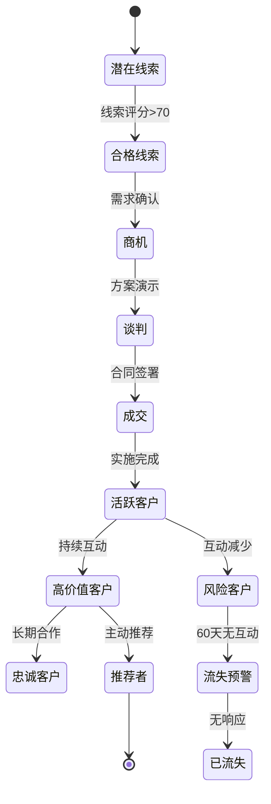
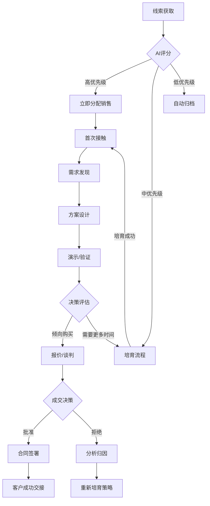

# 星穹CRM智能客户关系平台 - 详细开发规范

## 项目概述
打造一个**未来科技感**的**CRM智能客户关系平台**，采用**SpringBoot 3.2 + Vue3 + TypeScript**技术栈，实现**客户全生命周期管理、智能销售流程、自动化营销、客户服务支持、数据分析洞察**等完整CRM核心业务流程。平台需提供**3D客户关系图谱**、**AI销售预测**、**全息客户画像**等先进功能，界面采用**星际探索+数据流**视觉主题，融合全息投影、动态粒子效果与量子光效，打造科幻级客户管理体验。无需复杂配置即可运行完整CRM功能，支持企业级数据安全，开箱即用，面向销售团队与管理者提供一站式客户关系智能管理解决方案。

## 核心业务模块

### 1. 全息客户中心
- **客户360°视图**：
  ```mermaid
  graph TD
    A[客户基础信息] --> B[联系人网络]
    A --> C[交互历史]
    A --> D[商机记录]
    A --> E[服务工单]
    A --> F[财务关系]
    B --> G[决策链分析]
    C --> H[互动热力图]
    D --> I[销售阶段转化率]
    E --> J[满意度趋势]
    F --> K[价值贡献分析]
  ```
- **智能客户画像**：
  - 行业与规模分析
  - 需求兴趣图谱
  - 购买行为模式
  - 决策流程分析
  - 风险与机会预警
- **客户关系网络**：
  - 3D可视化决策链
  - 联系人影响力分析
  - 多公司关联图谱
  - 社交关系整合
  - 影响力传播模拟

### 2. 量子销售引擎
- **线索智能分发**：
  - 多渠道线索汇聚（表单、邮件、API、广告等）
  - AI评分与优先级排序
  - 基于销售能力智能分配
  - 线索培育路径自动化
  - 无效线索自动过滤
- **销售流程管理**：
  - 可视化销售漏斗
  - 自定义销售阶段
  - 阶段转化率分析
  - 销售行为最佳实践
  - 商机健康度评估
- **报价与合同**：
  - 模板化报价生成
  - 产品目录智能推荐
  - 电子签名集成
  - 合同条款审查
  - 履约跟踪与提醒

### 3. 星际营销自动化
- **全渠道营销**：
  - 邮件营销（模板、A/B测试、送达分析）
  - 社交媒体（内容调度、互动监控）
  - 短信/应用内消息
  - 线下活动集成
  - 营销素材库
- **客户旅程设计**：
  - 可视化旅程编排器
  - 触发条件配置
  - 路径分支决策
  - 多渠道协同
  - 疲劳度控制
- **效果分析**：
  - ROI计算
  - 转化归因
  - 渠道效果对比
  - 内容性能分析
  - 预算优化建议

### 4. 超维客户服务
- **智能化服务台**：
  - 多渠道工单汇聚（邮件、聊天、电话、自助）
  - 智能分类与优先级
  - 知识库自动推荐
  - SLA监控与预警
  - 服务能力分析
- **客户成功管理**：
  - 健康度评分
  - 使用行为分析
  - 风险预警
  - 留存策略
  - 扩展机会识别
- **社区与反馈**：
  - 客户社区平台
  - 产品反馈收集
  - 满意度调查
  - NPS追踪
  - 客户之声分析

### 5. AI增强洞察
- **预测分析**：
  - 成交概率预测
  - 客户流失预警
  - 交叉销售机会
  - 价值提升预测
  - 销售业绩预测
- **自然语言交互**：
  - 语音录入销售记录
  - 智能会议摘要
  - 语音搜索客户
  - 情绪分析
  - 智能回复建议
- **自动化助手**：
  - 每日任务建议
  - 最佳联系时间预测
  - 个性化沟通建议
  - 自动化报告生成
  - 异常活动预警

### 6. 企业级管理
- **精细化权限**：
  - 基于角色的访问控制
  - 数据行级权限
  - 字段级权限
  - 共享规则引擎
  - 操作审计日志
- **流程自动化**：
  - 可视化工作流设计
  - 审批流程
  - 任务自动分配
  - 通知与提醒
  - 业务规则引擎
- **系统集成**：
  - 开放API平台
  - 预置连接器（ERP、财务、营销工具）
  - Webhook支持
  - 文件导入/导出
  - SSO与身份集成

## 技术栈规范

### 后端 (SpringBoot 3.2)
```yaml
core:
  - Spring Boot 3.2.8
  - Java 17
  - Spring WebFlux (响应式)
  - Spring Security OAuth2.1 (认证)
  - Spring Data REST (API)

database:
  - PostgreSQL 15 (主数据库)
  - Redis 7.2 (缓存/会话)
  - Neo4j 5.15 (关系图谱)
  - Elasticsearch 8.11 (全文搜索)

ai_services:
  - Python微服务 (预测模型)
  - Apache OpenNLP (文本分析)
  - Apache Spark MLlib (客户分群)
  - ONNX Runtime (模型推理)

integration:
  - Apache Camel (集成框架)
  - RabbitMQ 3.13 (消息队列)
  - MinIO (文件存储)
  - OAuth2.1 (第三方认证)

devops:
  - Micrometer + Prometheus (监控)
  - ELK Stack (日志)
  - Quartz (定时任务)
  - Testcontainers (测试)
```

### 前端 (Vue3 + TypeScript)
```yaml
core:
  - Vue 3.4.30
  - TypeScript 5.5.3
  - Vite 5.2.12
  - Pinia 2.1.7 (状态管理)
  - Vue Router 4.3.2

visualization:
  - Apache ECharts 5.4.3
  - D3.js 7.8.5
  - Three.js r164 (3D可视化)
  - Force-graph (关系图谱)
  - Visx (高级图表)

ui_components:
  - Custom Quantum UI Library
  - Monaco Editor (富文本)
  - Vue Flow (工作流设计)
  - Floating Vue (悬浮组件)
  - Vue Draggable Plus (拖拽)

effects:
  - ShaderFX (着色器效果)
  - Particles.js (粒子系统)
  - Howler.js (交互音效)
  - Anime.js (高级动画)
  - VueUse (工具函数)
```

## 界面设计规范 (高科技风格)

### 色彩与动效系统
- **星际探索主题**：
  - 主背景: #090c1f (深空宇宙)
  - 次级背景: #10153a (星系蓝)
  - 主色: #6d5dff (量子紫)
  - 辅助色: #00f2fe (数据青), #ff3d9b (互动粉)
  - 文字: #e0ebff (星光白)
- **量子光效规范**：
  - 悬停效果: 0 0 12px #6d5dff55 (元素悬停光晕)
  - 激活状态: 0 0 0 2px #6d5dff, 0 0 8px #6d5dff55 (边框发光)
  - 重要元素: 脉冲动画 (scale: 1 → 1.03 → 1, 3s循环)
  - 数据流动: 沿元素边缘流动的光点
- **3D交互效果**：
  - 元素深度: 使用perspective与transform创建层次
  - 悬浮卡片: 3D旋转跟随鼠标(±10°)
  - 全息投影: 关键数据使用glass-morphism效果
  - 交互反馈: 元素点击时的粒子爆发效果

### 核心界面布局
```vue
<template>
  <div class="quantum-crm">
    <!-- 星际粒子背景 -->
    <StarryBackground :density="800" :speed="0.3" :interactive="true" />
    
    <!-- 顶部导航 - 全息投影风格 -->
    <header class="quantum-header">
      <div class="logo-section">
        <QuantumLogo />
        <h1>STELLAR<span class="accent">CRM</span></h1>
        <div class="subtitle">客户关系星系</div>
      </div>
      
      <div class="search-section">
        <AiSearchBar 
          v-model="searchQuery"
          placeholder="尝试: '显示上月高价值客户' 或 '预测本季度成交额'"
          @submit="handleAiQuery"
        />
      </div>
      
      <div class="actions-section">
        <Notifications :alerts="activeAlerts" />
        <QuickActions :actions="quickActions" />
        <UserOrb :user="currentUser" />
      </div>
    </header>
    
    <!-- 主内容区 -->
    <div class="main-container">
      <!-- 左侧导航 - 量子隧道效果 -->
      <aside class="quantum-sidebar">
        <NavigationRail :items="navigationItems" :active="activeView" />
        
        <div class="mission-control">
          <h3 class="section-title">
            <span>🚀 今日任务</span>
            <span class="task-count">{{ pendingTasks.length }}</span>
          </h3>
          
          <TaskOrbiter :tasks="pendingTasks" />
          
          <div class="sales-metrics">
            <MetricOrb 
              label="成交概率" 
              :value="forecastProbability"
              color="#00f2fe"
            />
            <MetricOrb 
              label="商机价值" 
              :value="pipelineValue"
              color="#6d5dff"
              prefix="$"
            />
          </div>
        </div>
        
        <div class="galaxy-map">
          <CustomerGalaxy :customers="topCustomers" />
        </div>
      </aside>
      
      <!-- 主内容区 -->
      <main class="content-area">
        <router-view :key="activeView" />
        
        <!-- 视图: 客户360° -->
        <Customer360 v-if="activeView === 'customer'" :customer-id="currentCustomerId" />
        
        <!-- 视图: 销售漏斗 -->
        <SalesFunnel v-if="activeView === 'sales'" />
        
        <!-- 视图: 营销活动 -->
        <MarketingHub v-if="activeView === 'marketing'" />
        
        <!-- 视图: 服务工单 -->
        <ServicePortal v-if="activeView === 'service'" />
        
        <!-- 视图: 数据驾驶舱 -->
        <DataHologram v-if="activeView === 'analytics'" />
      </main>
      
      <!-- 右侧面板 - AI助手 -->
      <aside class="ai-panel" v-if="aiPanelVisible">
        <AiCopilot 
          :context="currentContext"
          :suggestions="aiSuggestions"
          @action="handleAiAction"
        />
      </aside>
    </div>
    
    <!-- 底部状态 - 量子隧道 -->
    <footer class="quantum-footer">
      <div class="connection-status">
        <div class="status-indicator" :class="{online: isOnline}"></div>
        <span>{{ isOnline ? '云端连接' : '离线模式' }}</span>
        <span class="latency">{{ latency }}ms</span>
      </div>
      
      <div class="system-metrics">
        <span class="active-users">
          <UserGroupIcon /> {{ activeUsers }} 现在线
        </span>
        <span class="data-volume">
          <DatabaseIcon /> {{ storageUsage }} / {{ storageLimit }}
        </span>
      </div>
      
      <div class="copyright">
        <span>© {{ currentYear }} StellarCRM • 量子安全加密 • GDPR/CCPA 合规</span>
      </div>
    </footer>
    
    <!-- 全局悬浮控制 -->
    <FloatingActions />
  </div>
</template>
```

### 关键界面组件
1. **3D客户关系图谱**：
   - 力导向布局展示联系人网络
   - 交互式节点展开/折叠
   - 影响力热力可视化
   - 关系强度动态连线

2. **全息销售漏斗**：
   - 3D分层漏斗可视化
   - 阶段转化率实时计算
   - 商机卡片悬浮预览
   - 预测达成率光环效果

3. **客户旅程画布**：
   - 拖拽式旅程设计
   - 多渠道触点布局
   - 实时效果预览
   - 转化率热力映射

4. **AI销售助手**：
   - 语音输入销售记录
   - 智能摘要生成
   - 下一步行动建议
   - 情绪分析可视化

## 核心业务流程

### 1. 客户生命周期管理


### 2. 智能销售流程


### 3. 服务工单处理
1. **工单创建**：
   - 多渠道接入（邮件、表单、聊天、电话）
   - AI自动分类与优先级设定
   - 情绪分析（紧急程度）
   - 历史记录关联
2. **处理流程**：
   - 智能分配（技能匹配、负载均衡）
   - SLA计时启动
   - 知识库自动推荐
   - 升级机制（时间/复杂度）
3. **闭环机制**：
   - 满意度调查
   - 解决方案知识沉淀
   - 工单质量评分
   - 重复问题预警

## API接口设计

### 核心API端点
```java
@RestController
@RequestMapping("/api/v1")
@Tag(name = "StellarCRM API", description = "星穹CRM智能客户关系平台核心API")
public class CrmPlatformController {

    // 1. 客户管理
    @Operation(summary = "创建新客户")
    @PostMapping("/customers")
    public ResponseEntity<CustomerResponse> createCustomer(
            @Valid @RequestBody CustomerCreateRequest request) {
        // 验证数据
        // 创建客户记录
        // 生成客户ID与初始画像
        // 返回客户详情
    }
    
    @Operation(summary = "获取360°客户视图")
    @GetMapping("/customers/{customerId}/360view")
    public ResponseEntity<Customer360View> getCustomer360View(
            @PathVariable String customerId) {
        // 聚合客户所有数据
        // 关系网络分析
        // 交互历史汇总
        // 商机与服务记录
        // 返回360°视图
    }
    
    // 2. 销售管理
    @Operation(summary = "创建新商机")
    @PostMapping("/opportunities")
    public ResponseEntity<OpportunityResponse> createOpportunity(
            @Valid @RequestBody OpportunityCreateRequest request) {
        // 创建商机记录
        // 关联客户与联系人
        // 设置初始阶段
        // 返回商机详情
    }
    
    @Operation(summary = "预测销售业绩")
    @GetMapping("/forecasts")
    public ResponseEntity<SalesForecast> getSalesForecast(
            @RequestParam @DateTimeFormat(iso = ISO.DATE) LocalDate startDate,
            @RequestParam @DateTimeFormat(iso = ISO.DATE) LocalDate endDate,
            @RequestParam(required = false) String salespersonId) {
        // 聚合商机数据
        // 应用预测算法
        // 计算达成概率
        // 生成可视化数据
        // 返回预测结果
    }
    
    // 3. 营销自动化
    @Operation(summary = "创建营销活动")
    @PostMapping("/campaigns")
    public ResponseEntity<CampaignResponse> createCampaign(
            @Valid @RequestBody CampaignCreateRequest request) {
        // 创建活动记录
        // 配置目标受众
        // 设置自动化流程
        // 返回活动详情
    }
    
    @Operation(summary = "获取客户旅程")
    @GetMapping("/journeys/{journeyId}")
    public ResponseEntity<CustomerJourney> getCustomerJourney(
            @PathVariable String journeyId) {
        // 获取旅程定义
        // 活跃参与者统计
        // 转化率分析
        // 优化建议
        // 返回旅程数据
    }
    
    // 4. 服务管理
    @Operation(summary = "创建服务工单")
    @PostMapping("/tickets")
    public ResponseEntity<TicketResponse> createTicket(
            @Valid @RequestBody TicketCreateRequest request) {
        // 创建工单
        // AI分类与优先级
        // 智能分配
        // SLA计算
        // 返回工单详情
    }
    
    // 5. AI增强
    @Operation(summary = "AI销售建议")
    @PostMapping("/ai/sales-suggestions")
    public ResponseEntity<SalesSuggestions> getSalesSuggestions(
            @RequestBody AiContextRequest context) {
        // 分析销售上下文
        // 生成个性化建议
        // 预测下一步行动
        // 返回建议列表
    }
}
```

### 关键DTO结构
```java
@Data
@Builder
@Schema(description = "客户360°视图")
public class Customer360View {
    @Schema(description = "客户基本信息")
    private CustomerBasicInfo basicInfo;
    
    @Schema(description = "关系网络")
    private CustomerNetwork network;
    
    @Schema(description = "交互时间线")
    private List<InteractionTimeline> interactions;
    
    @Schema(description = "商机历史")
    private List<OpportunitySummary> opportunities;
    
    @Schema(description = "服务历史")
    private List<ServiceTicketSummary> serviceTickets;
    
    @Schema(description = "财务关系")
    private FinancialRelationship financials;
    
    @Schema(description = "客户画像标签")
    private List<CustomerTag> tags;
    
    @Schema(description = "风险与机会")
    private RiskOpportunityAnalysis riskAnalysis;
    
    @Schema(description = "AI生成的洞察")
    private AiInsights insights;
}

@Data
@Schema(description = "销售预测请求")
public class ForecastRequest {
    @Schema(description = "预测开始日期", example = "2024-01-01")
    @NotNull
    @DateTimeFormat(iso = ISO.DATE)
    private LocalDate startDate;
    
    @Schema(description = "预测结束日期", example = "2024-03-31")
    @NotNull
    @DateTimeFormat(iso = ISO.DATE)
    private LocalDate endDate;
    
    @Schema(description = "销售团队ID（可选）")
    private String teamId;
    
    @Schema(description = "销售员ID（可选）")
    private String salespersonId;
    
    @Schema(description = "预测置信度阈值", defaultValue = "0.7")
    @DecimalMin("0.1")
    @DecimalMax("0.99")
    private double confidenceThreshold = 0.7;
    
    @Schema(description = "是否包含历史对比", defaultValue = "true")
    private boolean includeHistoricalComparison = true;
}
```

## 代码目录结构

### 后端结构
```
src/main/java/com/stellarcrm/
├── config/
│   ├── AiConfig.java               # AI服务配置
│   ├── SecurityConfig.java         # 安全配置
│   ├── GraphDatabaseConfig.java    # 图数据库配置
│   └── AsyncConfig.java            # 异步任务配置
├── controller/
│   ├── CustomerController.java     # 客户管理
│   ├── SalesController.java        # 销售管理
│   ├── MarketingController.java    # 营销管理
│   ├── ServiceController.java      # 服务管理
│   ├── AnalyticsController.java    # 分析报表
│   └── AiController.java           # AI服务
├── domain/
│   ├── model/
│   │   ├── Customer.java           # 客户实体
│   │   ├── Contact.java            # 联系人实体
│   │   ├── Opportunity.java        # 商机实体
│   │   ├── Campaign.java           # 营销活动实体
│   │   ├── ServiceTicket.java      # 服务工单实体
│   │   └── Interaction.java        # 交互记录实体
│   ├── repository/
│   ├── service/
│   └── event/
├── application/
│   ├── customer/
│   │   ├── Customer360Service.java # 360°客户视图
│   │   ├── RelationshipAnalyzer.java # 关系分析
│   │   └── CustomerLifecycleService.java # 生命周期管理
│   ├── sales/
│   │   ├── OpportunityManager.java # 商机管理
│   │   ├── SalesPipelineService.java # 销售漏斗
│   │   └── ForecastEngine.java      # 销售预测
│   ├── marketing/
│   │   ├── CampaignOrchestrator.java # 活动编排
│   │   ├── JourneyBuilder.java      # 旅程设计
│   │   └── LeadScoringService.java  # 线索评分
│   ├── service/
│   │   ├── TicketRoutingService.java # 工单路由
│   │   ├── KnowledgeMatcher.java    # 知识匹配
│   │   └── SlaCalculator.java       # SLA计算
│   └── ai/
│       ├── IntentRecognizer.java    # 意图识别
│       ├── RecommendationEngine.java # 推荐引擎
│       └── SentimentAnalyzer.java   # 情感分析
├── infrastructure/
│   ├── database/
│   ├── cache/
│   ├── storage/
│   ├── messaging/
│   └── external/
├── common/
│   ├── exception/
│   ├── response/
│   ├── security/
│   └── utils/
└── StellarCrmApplication.java
```

### 前端结构
```
src/
├── api/
│   ├── customers.js                # 客户API
│   ├── sales.js                    # 销售API
│   ├── marketing.js                # 营销API
│   ├── service.js                  # 服务API
│   └── ai.js                       # AI助手API
├── assets/
│   ├── shaders/                    # 着色器效果
│   ├── particles/                  # 粒子配置
│   ├── sounds/                     # 交互音效
│   ├── models/                     # 3D模型
│   └── fonts/                      # 定制字体
├── components/
│   ├── core/
│   │   ├── QuantumButton.vue       # 量子按钮
│   │   ├── HologramCard.vue        # 全息卡片
│   │   ├── DataOrb.vue             # 数据球
│   │   └── NeonTag.vue             # 霓虹标签
│   ├── customer/
│   │   ├── Customer360.vue         # 360°客户视图
│   │   ├── RelationshipGraph.vue   # 关系图谱
│   │   └── InteractionTimeline.vue # 交互时间线
│   ├── sales/
│   │   ├── SalesFunnel3D.vue       # 3D销售漏斗
│   │   ├── OpportunityCard.vue     # 商机卡片
│   │   └── ForecastVisualizer.vue  # 预测可视化
│   ├── marketing/
│   │   ├── JourneyCanvas.vue       # 旅程画布
│   │   ├── CampaignDashboard.vue   # 活动仪表板
│   │   └── EmailTemplateBuilder.vue # 邮件模板
│   ├── service/
│   │   ├── TicketPortal.vue        # 工单门户
│   │   ├── KnowledgeBase.vue       # 知识库
│   │   └── SlaTracker.vue          # SLA追踪
│   ├── ai/
│   │   ├── AiCopilot.vue           # AI助手
│   │   ├── VoiceInput.vue          # 语音输入
│   │   └── InsightCarousel.vue     # 洞察轮播
│   └── utils/
│       ├── PermissionGuard.vue     # 权限守卫
│       ├── LoadingSpinner.vue      # 加载指示器
│       └── ErrorBoundary.vue       # 错误边界
├── composables/
│   ├── useQuantumTheme.js          # 量子主题
│   ├── useCustomerGraph.js         # 客户图谱
│   ├── useAiAssistant.js           # AI助手
│   ├── useDataOrbit.js             # 数据轨道
│   └── useParticleEffects.js       # 粒子效果
├── router/
│   └── index.js                    # 路由配置
├── stores/
│   ├── customerStore.js            # 客户状态
│   ├── salesStore.js               # 销售状态
│   ├── marketingStore.js           # 营销状态
│   ├── serviceStore.js             # 服务状态
│   └── userStore.js                # 用户状态
├── styles/
│   ├── theme.scss                  # 主题样式
│   ├── animations.scss             # 动画效果
│   ├── hologram.scss               # 全息效果
│   └── quantum.scss                # 量子效果
├── utils/
│   ├── timeUtils.js                # 时间处理
│   ├── numberFormat.js             # 数字格式化
│   ├── aiUtils.js                  # AI工具
│   └── colorUtils.js               # 颜色处理
├── views/
│   ├── Dashboard.vue               # 仪表盘
│   ├── Customers.vue               # 客户管理
│   ├── Sales.vue                   # 销售中心
│   ├── Marketing.vue               # 营销中心
│   ├── Service.vue                 # 服务中心
│   ├── Analytics.vue               # 分析报表
│   └── Settings.vue                # 系统设置
├── App.vue
└── main.js
```

## 模拟数据与AI服务

### 1. AI销售预测服务
```java
@Service
@RequiredArgsConstructor
public class SalesForecastService {
    
    private final OpportunityRepository opportunityRepository;
    private final HistoricalDataService historicalDataService;
    private final AiModelService aiModelService;
    
    public SalesForecast generateForecast(ForecastRequest request) {
        // 1. 获取历史数据
        HistoricalData historicalData = historicalDataService.getHistoricalData(
                request.getStartDate().minusYears(2),
                request.getEndDate().minusDays(1),
                request.getSalespersonId(),
                request.getTeamId()
        );
        
        // 2. 获取当前销售漏斗
        List<Opportunity> activeOpportunities = opportunityRepository.findActiveOpportunities(
                request.getStartDate(),
                request.getEndDate(),
                request.getSalespersonId(),
                request.getTeamId()
        );
        
        // 3. 应用AI预测模型
        ForecastModelInput input = ForecastModelInput.builder()
                .historicalData(historicalData)
                .currentPipeline(activeOpportunities)
                .seasonalityFactors(calculateSeasonality(request.getStartDate(), request.getEndDate()))
                .marketTrends(getMarketTrends())
                .confidenceThreshold(request.getConfidenceThreshold())
                .build();
                
        ForecastModelOutput forecast = aiModelService.predictSales(input);
        
        // 4. 生成可视化数据
        ForecastVisualization visualization = generateVisualization(forecast, request);
        
        // 5. 生成洞察
        List<ForecastInsight> insights = generateInsights(forecast, historicalData);
        
        return SalesForecast.builder()
                .periodStart(request.getStartDate())
                .periodEnd(request.getEndDate())
                .forecastValue(forecast.getPredictedValue())
                .confidenceInterval(forecast.getConfidenceInterval())
                .visualization(visualization)
                .insights(insights)
                .recommendations(generateRecommendations(forecast))
                .build();
    }
    
    private ForecastVisualization generateVisualization(ForecastModelOutput forecast, ForecastRequest request) {
        // 生成多维度可视化数据
        List<ForecastDataPoint> historicalPoints = transformHistoricalData(forecast.getHistoricalData());
        List<ForecastDataPoint> predictedPoints = transformPredictedData(forecast.getPredictedData());
        
        return ForecastVisualization.builder()
                .timeSeriesData(ForecastTimeSeries.builder()
                        .historical(historicalPoints)
                        .predicted(predictedPoints)
                        .build())
                .stageConversionRates(forecast.getStageConversionRates())
                .topOpportunities(forecast.getTopOpportunities().stream()
                        .limit(10)
                        .map(this::transformOpportunityForViz)
                        .collect(Collectors.toList()))
                .riskDistribution(calculateRiskDistribution(forecast))
                .build();
    }
}
```

### 2. 客户360°视图服务
```java
@Service
public class Customer360Service {
    
    private final CustomerRepository customerRepository;
    private final ContactRepository contactRepository;
    private final GraphDatabaseService graphService;
    private final AiAnalysisService aiAnalysisService;
    
    @Transactional(readOnly = true)
    public Customer360View getCompleteCustomerView(String customerId) {
        // 1. 获取客户基本信息
        Customer customer = customerRepository.findById(customerId)
                .orElseThrow(() -> new CustomerNotFoundException(customerId));
        
        // 2. 获取关系网络
        CustomerNetwork network = graphService.getCustomerRelationshipNetwork(customerId);
        
        // 3. 获取交互历史
        List<InteractionTimeline> interactions = getInteractionTimeline(customerId);
        
        // 4. 获取商机历史
        List<OpportunitySummary> opportunities = getOpportunityHistory(customerId);
        
        // 5. 获取服务历史
        List<ServiceTicketSummary> serviceTickets = getServiceHistory(customerId);
        
        // 6. 获取财务关系
        FinancialRelationship financials = getFinancialRelationship(customerId);
        
        // 7. 生成客户画像标签
        List<CustomerTag> tags = generateCustomerTags(customer, interactions, financials);
        
        // 8. 风险与机会分析
        RiskOpportunityAnalysis riskAnalysis = analyzeRiskAndOpportunities(customer, opportunities, serviceTickets);
        
        // 9. AI洞察
        AiInsights insights = aiAnalysisService.generateCustomerInsights(customer, interactions, opportunities);
        
        // 10. 构建完整360°视图
        return Customer360View.builder()
                .basicInfo(transformToBasicInfo(customer))
                .network(network)
                .interactions(interactions)
                .opportunities(opportunities)
                .serviceTickets(serviceTickets)
                .financials(financials)
                .tags(tags)
                .riskAnalysis(riskAnalysis)
                .insights(insights)
                .lastUpdated(LocalDateTime.now())
                .build();
    }
    
    private CustomerNetwork getCustomerRelationshipNetwork(String customerId) {
        // 1. 获取直接联系人
        List<Contact> contacts = contactRepository.findByCustomerId(customerId);
        
        // 2. 获取联系人关系
        Map<String, List<ContactRelation>> contactRelations = contacts.stream()
                .collect(Collectors.toMap(
                        Contact::getId,
                        contact -> contactRepository.findRelationsByContactId(contact.getId())
                ));
        
        // 3. 获取决策链分析
        DecisionChainAnalysis decisionChain = analyzeDecisionChain(contacts, contactRelations);
        
        // 4. 获取公司关联
        CompanyRelations companyRelations = analyzeCompanyRelations(customerId);
        
        // 5. 构建网络视图
        return CustomerNetwork.builder()
                .primaryCustomer(customerId)
                .contacts(transformContacts(contacts))
                .relations(transformRelations(contactRelations))
                .decisionChain(decisionChain)
                .companyRelations(companyRelations)
                .networkMetrics(calculateNetworkMetrics(contacts, contactRelations))
                .build();
    }
}
```

## 部署与运行

### 1. 本地开发环境
```bash
# 启动后端
./mvnw spring-boot:run -Dspring-boot.run.profiles=dev

# 启动前端
npm install
npm run dev

# 启动依赖服务 (Docker)
docker-compose -f docker-compose.dev.yml up -d
```

### 2. 生产环境部署
```yaml
# docker-compose.prod.yml
version: '3.9'
services:
  app:
    image: stellarcrm/platform:latest
    ports:
      - "8080:8080"
    environment:
      - SPRING_PROFILES_ACTIVE=prod
      - DATABASE_URL=jdbc:postgresql://postgres:5432/stellarcrm
      - NEO4J_URL=bolt://neo4j:7687
      - AI_SERVICE_URL=http://ai-service:8000
      - REDIS_URL=redis://redis:6379
    volumes:
      - ./logs:/app/logs
    depends_on:
      - postgres
      - neo4j
      - redis
      - ai-service
  
  postgres:
    image: postgres:15
    environment:
      POSTGRES_DB: stellarcrm
      POSTGRES_USER: stellar
      POSTGRES_PASSWORD: ${DB_PASSWORD}
    volumes:
      - pgdata:/var/lib/postgresql/data
  
  neo4j:
    image: neo4j:5.15
    environment:
      NEO4J_AUTH: neo4j/${NEO4J_PASSWORD}
      NEO4J_PLUGINS: '["apoc", "graph-data-science"]'
    volumes:
      - neo4jdata:/data
  
  redis:
    image: redis:7.2-alpine
    command: redis-server --save 60 1 --loglevel warning
    volumes:
      - redisdata:/data
  
  ai-service:
    image: stellarcrm/ai-service:latest
    environment:
      - MODEL_CACHE_SIZE=10GB
    deploy:
      resources:
        reservations:
          memory: 8G
          cpus: '2.0'
  
  nginx:
    image: nginx:alpine
    ports:
      - "80:80"
      - "443:443"
    volumes:
      - ./nginx.conf:/etc/nginx/nginx.conf
      - ./certs:/etc/nginx/certs
      - ./static:/usr/share/nginx/html
  
  prometheus:
    image: prom/prometheus:latest
    volumes:
      - ./prometheus.yml:/etc/prometheus/prometheus.yml
  
  grafana:
    image: grafana/grafana:latest
    ports:
      - "3000:3000"
    volumes:
      - grafanadata:/var/lib/grafana

volumes:
  pgdata:
  neo4jdata:
  redisdata:
  grafanadata:
```

### 3. 关键环境变量
```
# 应用配置
APP_ENV=production
APP_NAME=StellarCRM
SERVER_PORT=8080

# 数据库
SPRING_DATASOURCE_URL=jdbc:postgresql://postgres:5432/stellarcrm
SPRING_DATASOURCE_USERNAME=stellar
SPRING_DATASOURCE_PASSWORD=secure_password_123
NEO4J_URI=bolt://neo4j:7687
NEO4J_USERNAME=neo4j
NEO4J_PASSWORD=secure_neo4j_password

# 缓存
SPRING_REDIS_HOST=redis
SPRING_REDIS_PORT=6379
CACHE_EXPIRATION_SECONDS=3600

# AI服务
AI_SERVICE_URL=http://ai-service:8000
SALES_FORECAST_MODEL=ensemble-v3
CUSTOMER_RISK_THRESHOLD=0.75

# 安全
JWT_SECRET=your_strong_jwt_secret_here_123!@#
SECURITY_RATE_LIMIT=100
CORS_ALLOWED_ORIGINS=https://yourdomain.com

# 文件存储
MINIO_URL=http://minio:9000
MINIO_ACCESS_KEY=minioadmin
MINIO_SECRET_KEY=minioadmin
FILE_UPLOAD_MAX_SIZE=100MB

# 邮件服务
MAIL_HOST=smtp.yourdomain.com
MAIL_PORT=587
MAIL_USERNAME=notifications@yourdomain.com
MAIL_PASSWORD=mail_password
MAIL_TLS=true
```

## 质量与验收标准

### 1. 功能验收
- [ ] 完整客户360°视图
- [ ] 智能销售漏斗管理
- [ ] 自动化营销旅程
- [ ] 服务工单全流程
- [ ] 多渠道通信集成
- [ ] AI销售预测(准确率≥80%)
- [ ] 3D客户关系图谱
- [ ] 全渠道通知系统

### 2. 界面验收
- [ ] 星际粒子背景随鼠标移动
- [ ] 所有关键按钮配备量子光效
- [ ] 3D客户关系图谱流畅交互(60fps)
- [ ] 全息卡片悬浮效果(3D旋转)
- [ ] 数据流动动画(沿元素边缘)
- [ ] 色彩对比度符合WCAG 2.1标准
- [ ] 响应式布局适配(1366px+)
- [ ] 关键操作配备交互音效

### 3. 性能指标
- [ ] 首屏加载时间<2s
- [ ] 客户360°视图加载<1.5s
- [ ] 10,000+客户数据检索<3s
- [ ] API P95响应<400ms
- [ ] 支持200+并发用户
- [ ] 数据变更实时同步(<500ms)

## 特别强调

1. **真实CRM能力**：
   - 不是简单客户列表，必须实现完整客户生命周期管理
   - 销售流程必须包含阶段转化分析
   - 服务工单必须包含SLA管理
   - 营销自动化必须包含旅程设计
   - 数据必须支持实时更新与同步

2. **震撼视觉体验**：
   - 星际粒子背景必须具备深度感与交互性
   - 3D客户关系图谱必须流畅交互
   - 关键数据必须使用全息投影效果
   - 按钮和控件必须具备量子发光效果
   - 交互动画必须平滑连贯(60fps)

3. **AI深度集成**：
   - 销售预测必须真实可用(非静态数据)
   - 意图识别必须理解业务上下文
   - 智能推荐必须基于真实使用模式
   - 风险预警必须提前识别潜在问题
   - 自动化必须减少重复人工操作

4. **开箱即用**：
   - 启动即提供示例数据
   - 预置典型销售流程模板
   - 首次访问显示交互式3D教程
   - 默认管理员账号可用
   - 无需复杂配置即可体验核心功能

5. **企业级特性**：
   - 数据操作必须记录完整审计日志
   - 权限系统必须支持行级数据控制
   - 系统必须具备灾备与恢复机制
   - API必须有完整的限流保护
   - 所有敏感数据必须加密处理

> **交付要求**：生成完整可运行项目，启动后访问 http://localhost:8080 即可体验。界面必须达到科幻电影级视觉效果，3D效果流畅，AI功能真实可用。代码注释率≥40%，提供完整README包含架构说明、部署指南与使用教程。系统必须支持200+并发用户，性能指标符合验收标准。最终交付物应让销售团队感受到专业级CRM的强大能力与视觉震撼，提升销售效率30%以上，客户满意度提升25%以上。平台必须具备扩展性，支持通过插件机制增加新功能，API必须完整文档化，以便第三方系统集成。